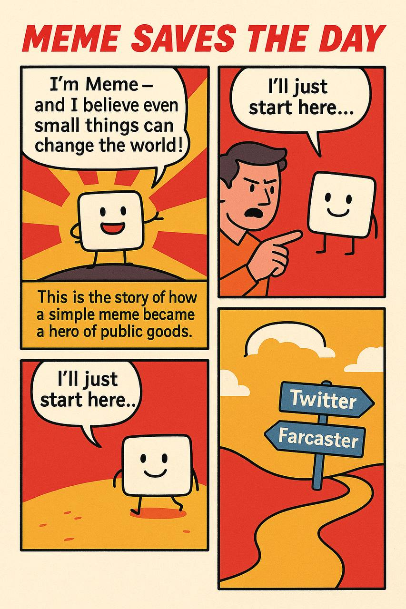
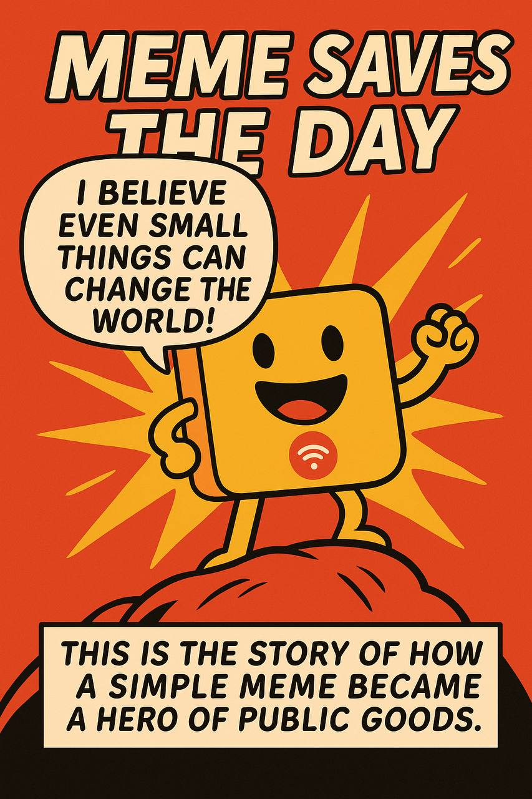

# BuildForGood-OP-Comics
📌 **This project is part of the BuildForGood ecosystem — a multi-project public goods initiative for Optimism**.

Optimism-themed comics published in PDF format and connected with NFT editions.

---

## 📖 Comics
- Download PDF -- manifold.xyz/@stephan1516417/id/4185753840
Preview:

---

## 🎨 NFTs
Each comic is also released as an NFT edition:  
- Collection: opensea.io/collection/meme-saves-the-day
  

---

## 🌍 Impact
- Part of the BuildForGood ecosystem  
- Expanding the cultural layer of Optimism  
- Making Optimism fun and accessible through visual storytelling

## 📜 License
This repository is licensed under the [MIT License](./LICENSE).

## 🌍 BuildForGood Ecosystem  
**This project is part of the BuildForGood Ecosystem for Optimism**.  

📖 Books & Articles • 🕹 Games • 🖼 NFTs & Memes • 🌍 Onchain Artifacts • 🎥 Media  

🔗 Explore the full ecosystem: [BuildForGood Ecosystem on Optimism Atlas](https://atlas.optimism.io/profile/organizations/BuildForGood%20Ecosystem)

